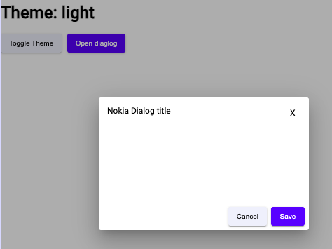
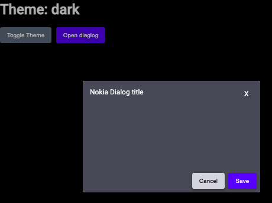

## Overview

This example project demonstrates the utilization and customization of an Angular Material component, showcasing its theming capability.

[DEMO](https://nghilevi.github.io/custom-angular-material-dialog
/)

## Screenshots

### Light theme

### Dark theme

## Development

Run `npm run start` for a dev server. Navigate to `http://localhost:4200/`. The application will automatically reload if you change any of the source files.
